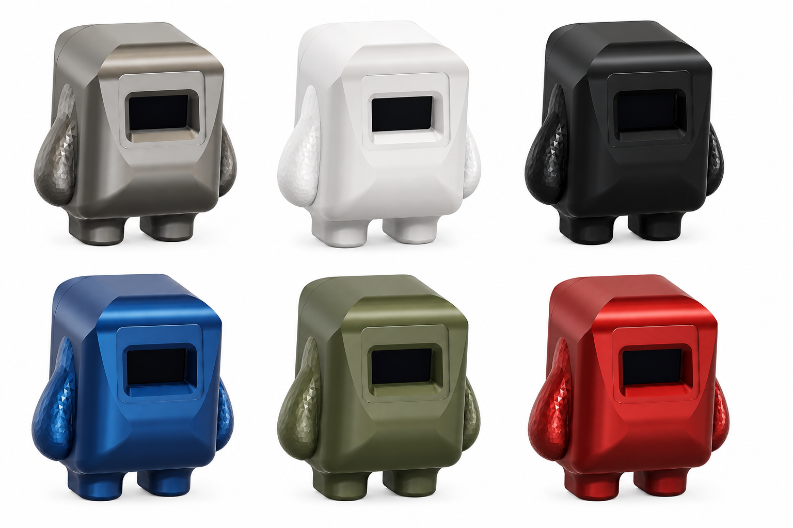

# Kubi Modular Desk Pet System 

    
    
    
    
     

Kubi is a modular desk pet platform designed to create an interactive and expressive desktop companion using embedded systems, sensors, wireless communication, and animated visual feedback.

Built around the DevLab ecosystem and the Pulsar ESP32 series, Kubi combines motion sensing, OLED-based emotions, modular expansion, and wireless connectivity into a customizable development platform suitable for makers, students, educators, and embedded developers.

Kubi can display emotions, react to movement, enter idle animation modes, visualize system status, and serve as a platform for experimentation with sensors, IoT, and embedded AI applications.

  

## Features

- Animated emotional expressions on OLED display
- Motion and orientation detection using BMI270
- Modular QWIIC/DevLab ecosystem connectivity
- Wireless communication support via ESP32-C6/H2
- Battery-powered portable operation
- Expandable sensor architecture
- Interactive idle and reaction states
- Designed for experimentation and education
- Compatible with Arduino, MicroPython, and native SDK development

# System Architecture

Kubi is based on a modular architecture that allows multiple peripherals and sensors to be connected through standardized QWIIC interfaces.

Main subsystems include:

| Module | Function |
|---|---|
| Pulsar ESP32-C6/H2 | Main processing and connectivity |
| OLED SSD1306 | Facial expressions and status visualization |
| BMI270 IMU | Motion and orientation sensing |
| LiPo Battery System | Portable power supply |
| QWIIC Expansion Hub | Modular sensor connectivity |
| DevLab Ecosystem Modules | Future expansion support |

## License

All hardware and documentation in this project are licensed under the **MIT License**.  
Please refer to [`LICENSE.md`](LICENSE.md) for full terms.

  Template created by UNIT Electronics • Adapt this file to document your board!

