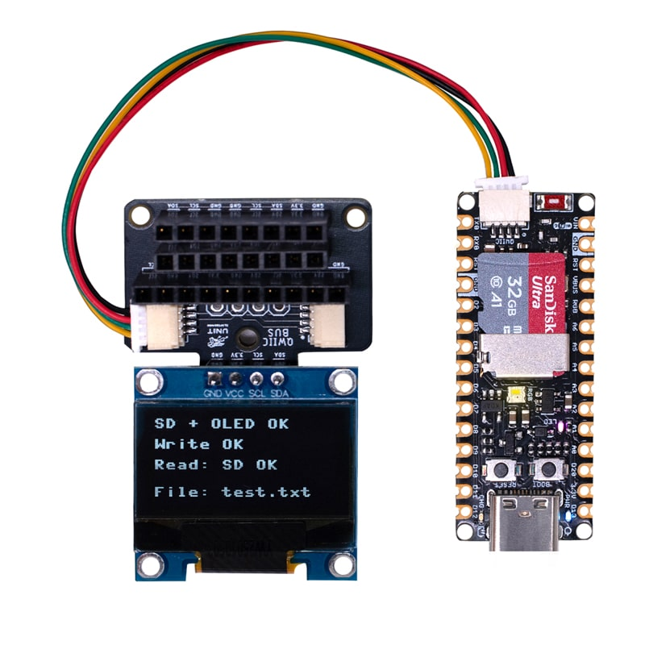

## Minimal Hardware Requirements

The Kubi Modular Desk Pet System requires the following hardware components:

- **Pulsar ESP32-C6/H2**: The main microcontroller platform that provides processing power and wireless communication capabilities.
- **OLED SSD1306 Display**: A small OLED display used to show emotions, animations, and system status.
- **BMI270 IMU Sensor**: An inertial measurement unit that detects motion and orientation, allowing Kubi to react to movement and gestures.
- **LiPo Battery System**: A
    portable power source that enables Kubi to operate without being tethered to a power outlet.    

- **QWIIC Connectors**: Standardized modular connection system that allows for easy expansion and integration of additional sensors and peripherals.

- **DevLab Ecosystem Modules**: Support for future expansion with additional sensors, actuators, and communication modules within the DevLab ecosystem.

